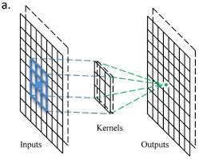

# Background and Basics 

### What are `Channels` and `Kernels`? 
**`Channels`** come from `media`. Looking at broadcast technology behind TVs you have mulitple channels for different information that gets broadcasted to your TV. Let's assume that we are talking about 2D convolutions applied on images. 

In a grayscale image, the data is a matrix of dimensions **_w×h_**, where **_w_** is the `width` of the image and **_h_** is its `height`. In a color image, we normally have 3 channels: `red, green and blue` ; this way, a color image can be represented as matrix of dimensions **_w×h×c_**, where **_c_** is the `number of channels`, that is, 3.
    
A convolution layer receives the image **_w×h×c_** as input, and generates as output an activation map of dimensions **_w′×h′×c′_**. The number of input channels in the convolution is c, while the number of output channels is **_c′_** . The filter for such a convolution is a tensor of dimensions **_f×f×c×c′_** , where **_f_** is the filter size (normally 3 or 5).

This way, the number of channels is the `depth of the matrices involved in the convolutions`. Also, a convolution operation defines the variation in such depth by specifying input and output channels.

These explanations are directly extrapolable to 1D signals or 3D signals, but the analogy with image channels made it more appropriate to use 2D signals in the example.

  
**`Kernels`** are nothing but a filter that is used to extract the features from the images. The kernel is a matrix that moves over the input data, performs the dot product with the sub-region of input data, and gets the output as the matrix of dot products. Kernel moves on the input data by the stride value. If the stride value is 2, then kernel moves by 2 columns of pixels in the input matrix. In short, the kernel is used to extract high-level features like edges from the image.

### Why should we (nearly) `always use 3x3 kernels`? 
This question can be answered in two parts. `One part` is to answer `why noy even kernels` _(2x2, 4x4)_ and the `second part` is why not using `bigger kernels`_(5x5, 7x7, 9x9..)_ .

First, with even kernels the problem is its difficult to find axis of symmetry. Without centre point, it is difficult to depict information in a symmetric way.

Second, using a `higher size kernel increases the computation cost` with more number of parameters and also the amount of information or features extracted are considerably lesser (as the dimension of next layer reduces greatly). Using a `lower size kernel like 1x1 does not account of features from the neighbouring pixels`, 1x1 is used only in cases of reducing the dimensions.

3x3 is the smallest unit which can be used to compute any kernel size output and seems to be a best fit. If we need 5x5 kernel output, we can convolve with _3x3 twice (3x3 + 3x3 = 18 parameter)_ and if we need 7x7 output, we can convolve using _3x3 thrice (33 + 33 + 3*3 = 27 parameters)_ and so on. And GPUs have accelerated 3x3 operation, so it is much faster to perform the convolution using 3x3 kernel.

### How many times do we need to perform 3x3 convolution operation to reach 1x1 from 199x199 (show calculations) 

  
Each time, when a 3x3 convolution is performed, we end up with 2 pixels lesser output channel. When we perform 3x3 on 5x5 image, we get a 3x3 image.

Without Max-pooling, **99 times** 3x3 convolution needs to be performed on 199x199 to reach 1x1 image!

|  Operation-No | Image O/P	|
|---------------|-----------|
|		1		|	197X197	|
|		2		|	195X195	|
|		3		|	193X193	|
|		4		|	191X191	|
|		5		|	189X189	|
|		6		|	187X187	|
|		7		|	185X185	|
|		8		|	183X183	|
|		9		|	181X181	|
|		10		|	179X179	|
|		11		|	177X177	|
|		12		|	175X175	|
|		13		|	173X173	|
|		14		|	171X171	|
|		15		|	169X169	|
|		16		|	167X167	|
|		17		|	165X165	|
|		18		|	163X163	|
|		19		|	161X161	|
|		20		|	159X159	|
|		21		|	157X157	|
|		22		|	155X155	|
|		23		|	153X153	|
|		24		|	151X151	|
|		25		|	149X149	|
|		26		|	147X147	|
|		27		|	145X145	|
|		28		|	143X143	|
|		29		|	141X141	|
|		30		|	139X139	|
|		31		|	137X137	|
|		32		|	135X135	|
|		33		|	133X133	|
|		34		|	131X131	|
|		35		|	129X129	|
|		36		|	127X127	|
|		37		|	125X125	|
|		38		|	123X123	|
|		39		|	121X121	|
|		40		|	119X119	|
|		41		|	117X117	|
|		42		|	115X115	|
|		43		|	113X113	|
|		44		|	111X111	|
|		45		|	109X109	|
|		46		|	107X107	|
|		47		|	105X105	|
|		48		|	103X103	|
|		49		|	101X101	|
|		50		|	99X99	|
|		51		|	97X97	|
|		52		|	95X95	|
|		53		|	93X93	|
|		54		|	91X91	|
|		55		|	89X89	|
|		56		|	87X87	|
|		57		|	85X85	|
|		58		|	83X83	|
|		59		|	81X81	|
|		60		|	79X79	|
|		61		|	77X77	|
|		62		|	75X75	|
|		63		|	73X73	|
|		64		|	71X71	|
|		65		|	69X69	|
|		66		|	67X67	|
|		67		|	65X65	|
|		68		|	63X63	|
|		69		|	61X61	|
|		70		|	59X59	|
|		71		|	57X57	|
|		72		|	55X55	|
|		73		|	53X53	|
|		74		|	51X51	|
|		75		|	49X49	|
|		76		|	47X47	|
|		77		|	45X45	|
|		78		|	43X43	|
|		79		|	41X41	|
|		80		|	39X39	|
|		81		|	37X37	|
|		82		|	35X35	|
|		83		|	33X33	|
|		84		|	31X31	|
|		85		|	29X29	|
|		86		|	27X27	|
|		87		|	25X25	|
|		88		|	23X23	|
|		89		|	21X21	|
|		90		|	19X19	|
|		91		|	17X17	|
|		92		|	15X15	|
|		93		|	13X13	|
|		94		|	11X11	|
|		95		|	9X9	    |
|		96		|	7X7	    |
|		97		|	5X5	    |
|		98		|	3X3	    |
|		99		|	1X1	    |

### How are kernels initialized? 

### What happens during the training of a DNN? 
